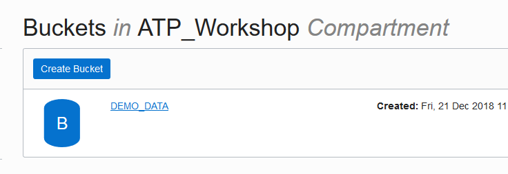
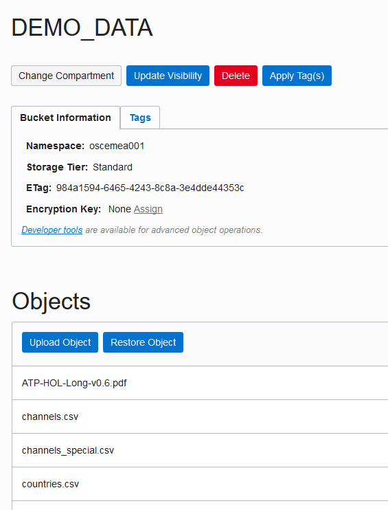
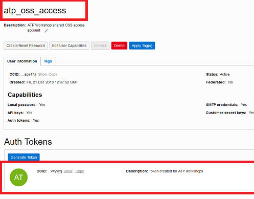

 
# Appendix B – Creating and preparing a user to access Object Storage #

## Information about how the environment was prepared ##

To load data from the Oracle Cloud Infrastructure Object Storage you will need a Cloud user with the appropriate privileges to read data from the Object Store. The communication between the database and the object store relies on the Swift protocol and a username/password authentication token. 

 

This is an outline of the steps that your instructor carried out – your lab user does not have permission to do these operations, or to see all of the referenced objects.

 

Select/Create your object storage bucket.

                                                  

Upload the files to the object storage bucket.

   

Construct the URL that points to the location of the file staged in the OCI Object Storage. The URL is structured as follows `https://swiftobjectstorage.<region_name>.oraclecloud.com/v1/<tenant_name>/<bucket_name>/<file_name>`

 

Create a user, in this example,  'atp_oss_access' and associate the user with a group. 
 

 

Create a policy statement to allow the group to read the object storage bucket.

   

Create an Authentication Token (Auth Token) for this user. Make a note of it as you are only told this information once.

 

   

To access data in the Object Store you must enable your database user to authenticate itself with the Object Store using your object store account and Auth Token. 

 

You do this by creating a private CREDENTIAL object for your user that stores this information encrypted in your ATP instance using the DBMS_CLOUD package. This encrypted connection information is only usable by your user schema.

 

 

`set define off
begin
  DBMS_CLOUD.create_credential(
    credential_name => 'OBJ_STORE_CRED',
    username => 'atp_oss_access',
    password => '<your auth token>'
  );
end;
/`

 

 

[Return to the Lab Introduction Page](readme.md)
