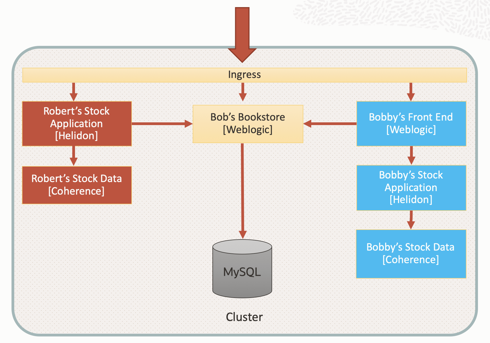

## Introduction
Verrazzano is an end-to-end Enterprise Container Platform for deploying cloud-native and traditional applications in multi-cloud and hybrid environments. It is made up of a curated set of open source components – many that you may already use and trust, and some that were written specifically to pull together all of the pieces that make Verrazzano a cohesive and easy to use platform.

Verrazzano Enterprise Container Platform includes the following capabilities:

- Hybrid and multi-cluster workload management
- Special handling for WebLogic, Coherence, and Helidon applications
- Multi-cluster infrastructure management
- Integrated and pre-wired application monitoring
- Integrated security
- DevOps and GitOps enablement

In this lab you will install Verrazzano on your OKE Cluster and deploy a sample application with it. This sample application consists of multiple workloads stemming from Helidon, Coherence and Weblogic. The main parts of the application consists of:

   - A back-end "order processing" application, which is a Java EE application with REST services and a very simple JSP UI, which stores data in a MySQL database. This application runs on WebLogic Server.
   - A front-end web store "Robert's Books", which is a general book seller. This is implemented as a Helidon microservice, which gets book data from Coherence (using CDI) and has a React web UI.
   - A front-end web store "Bobby's Books", which is a children's book store. This is implemented as a Helidon microservice which gets book data from a (different) Coherence using CDI and has a JSF web UI running on WebLogic Server.



Verrazzano will also spin up various telemetry components for you to be able to monitor and manage the different workloads in your environment. 

## Prerequisites

To run these labs you will need access to an Oracle Cloud Tenancy, either via a **Free Tier**, using a **Pay-as-you-Go** account, or using the **Corporate account** of your organization. 

If you do not have an account yet, you can obtain an Oracle Free Tier account by [clicking here.](https://myservices.us.oraclecloud.com/mycloud/signup?sourceType=:ow:wb:sh:em::RC_WWMK200517P00003:Vlab_Weblogic_July&intcmp=:ow:wb:sh:em::RC_WWMK200517P00003:Vlab_Weblogic_July)

Also make sure that you you have enough resources to spin up 
- 3 compute nodes. This has been tested running `2.4VM Shapes`, which is the recommendation.  
- 1 VCN
- 1 Load Balancer
- 3 Public IPs

These 2 privileges are also required in the tenancy;
```
Allow group MyGroup to use the cloud-shell in tenancy
Allow group MyGroup to manage all-resources in compartment MyCompartment
```


